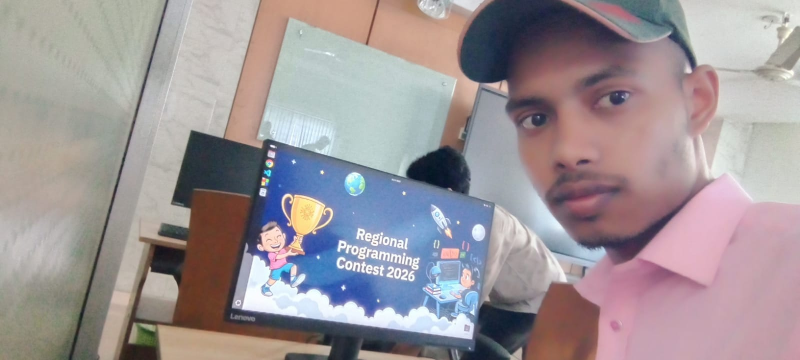
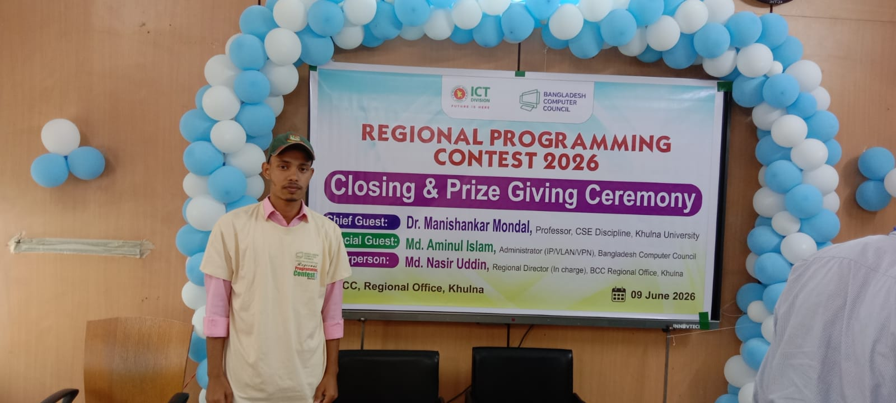
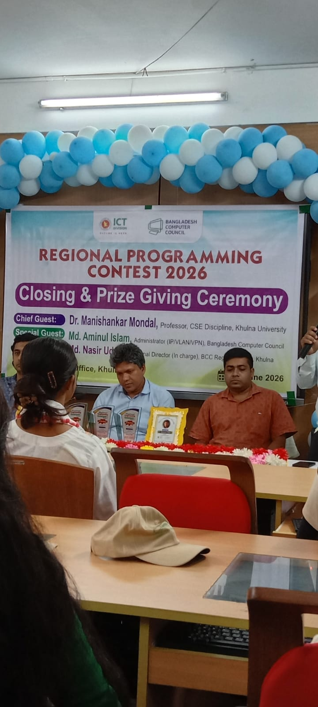
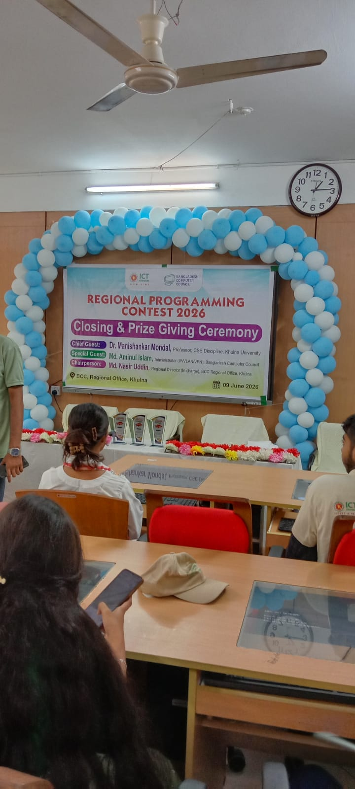
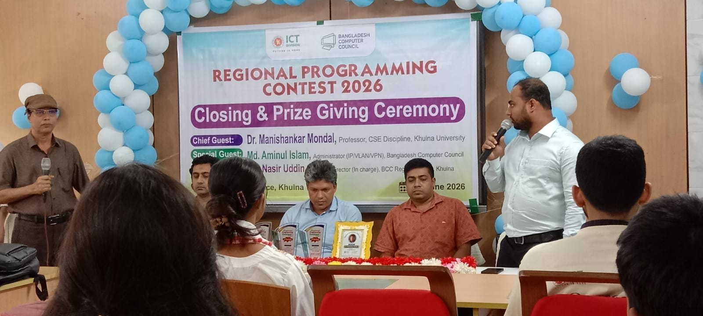
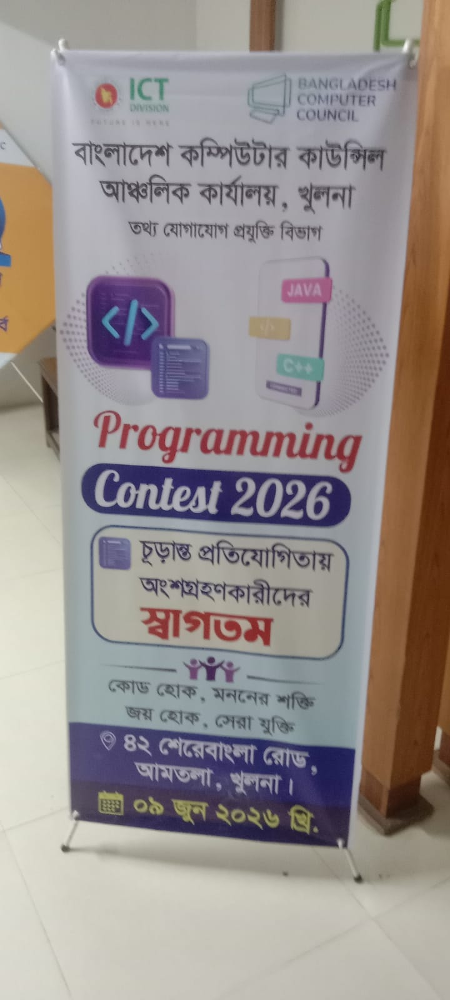
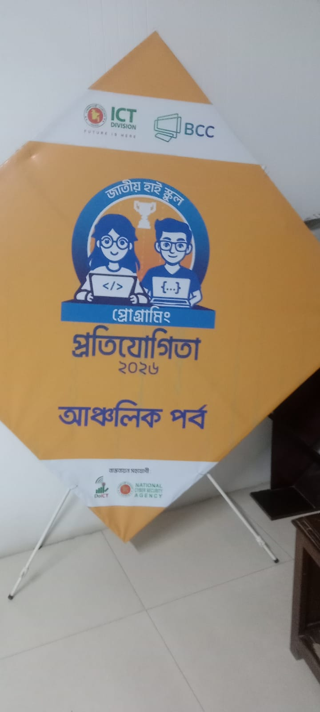

 🏆 BCC Regional Programming Contest 2026

> An archive of my event highlights and memories from the Regional Programming Contest 2026, organized by the Bangladesh Computer Council (BCC) in Khulna on 09 June, 2026.

## 👨‍💻 Participant Info
* **Name:** Md. Zihad Islam
* **GitHub:** [@md-zihad-coder](https://github.com/md-zihad-coder)

   📅 Event Details
* **Event:** Regional Programming Contest 2026
* **Organizer:** Bangladesh Computer Council (BCC), ICT Division
* **Location:** Khulna Regional Office, Bangladesh
* **Date:** 09 June, 2026

---

## 📸 Event Highlights & Gallery

Here are some captured moments from the programming contest, including the coding environment and the prize-giving ceremony.

### 💻 Contest Environment

### 🏅 Closing & Prize Giving Ceremony

### 🎯 Banners & Memories

---
*Created by [Md. Zihad Islam](https://github.com/md-zihad-coder)*
